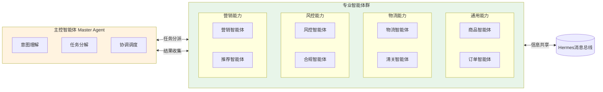
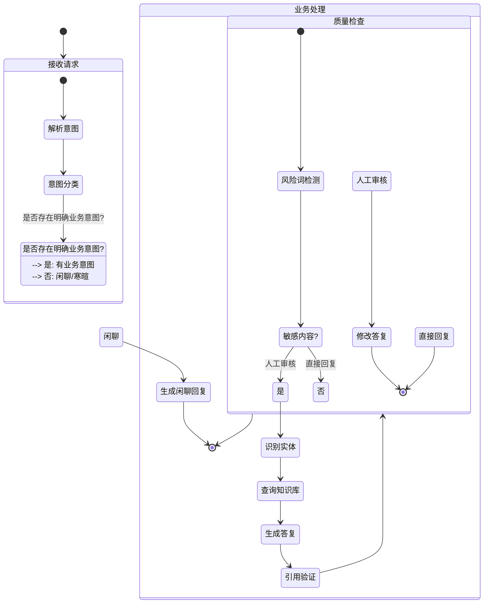
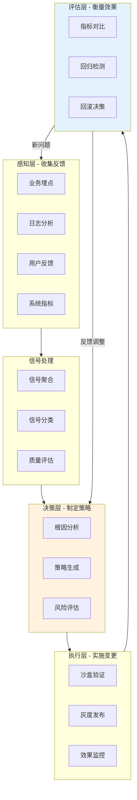
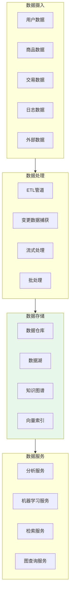
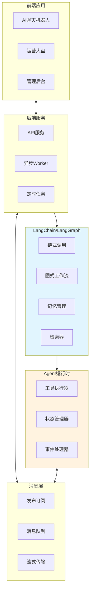
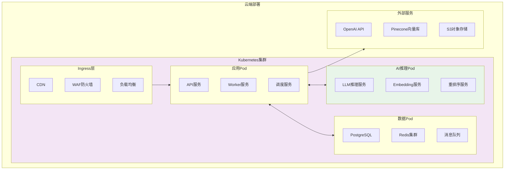
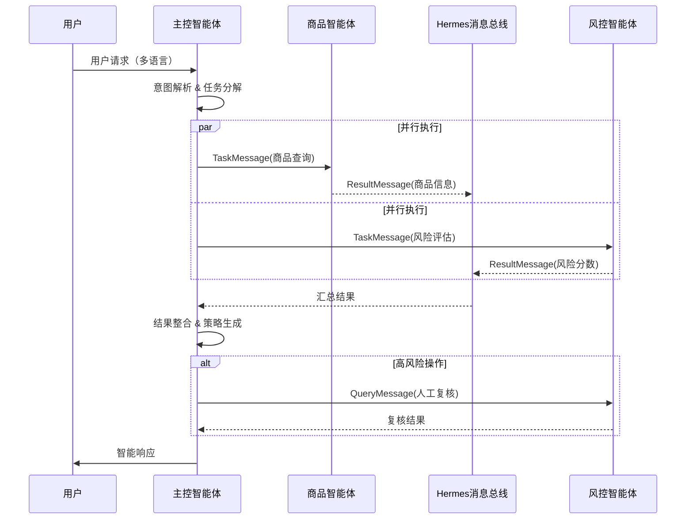
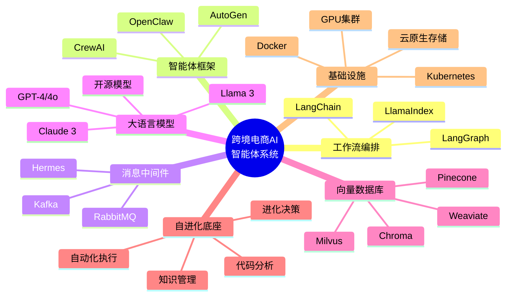

# 跨境电商AI智能体系统 - 技术架构图集

## 1. 整体系统架构图

```mermaid
flowchart TB
    subgraph UI["用户交互层"]
        Web[Web应用]
        App[移动App]
        API[API网关]
        Dashboard[监控大屏]
    end
    
    subgraph APP["业务应用层"]
        PM[商品管理]
        OM[订单管理]
        LM[物流管理]
        MK[营销管理]
        RM[风险管理]
    end
    
    subgraph ORCH["服务编排层"]
        GW[API网关]
        LB[负载均衡]
        RL[限流熔断]
        MG[服务治理]
    end
    
    subgraph ENGINE["核心引擎层"]
        LG["LangGraph\n工作流引擎"]
        OC["OpenClaw\n智能体运行时"]
        HR["Hermes\n消息引擎"]
        EV["自进化\n引擎"]
    end
    
    subgraph DATA["数据存储层"]
        RDB[(关系型数据库)]
        VDB[(向量数据库)]
        OBJ[(对象存储)]
        TSDB[(时序数据库)]
        KGV[(知识图谱)]
    end
    
    subgraph INF["基础设施层"]
        K8S[Kubernetes]
        GPU[GPU集群]
        CDN[内容分发网络]
        NET[网络基础设施]
    end
    
    UI --> APP
    APP --> ORCH
    ORCH --> ENGINE
    ENGINE <--> DATA
    DATA --> INF
    
    style ENGINE fill:#e1f5fe
    style INF fill:#f3e5f5
```

---

## 2. 多智能体协作架构图

---

## 3. LangGraph工作流示例：智能客服处理流程

---

## 4. 自进化闭环架构图

---

## 5. 数据流架构图

---

## 6. 技术组件集成图

---

## 7. 部署架构图

---

## 8. 智能体消息协议图

---

## 9. 技术选型总览图

---

*文档版本：v1.0 | 生成日期：2026-04-15*
